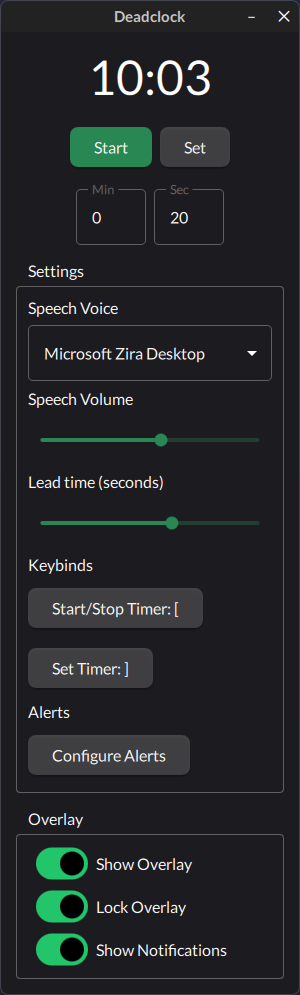

# DeadClock

An app to help you remember critical timings in valve's DeadLock game.



## Features

### Alerts
Currently has alerts for the following in game events:
* Breakables and small camps spawning (2:00)
* Medium camps spawning (6:00)
* Sinners Sacrifice and large camps spawning (8:00)
* Mid-Boss and the Breakables above it spawning (10:00)
* Repeating alert for runes spawning (every 5:00)
* Repeating alert for urn spawning (first at 10:00, then every 5:00)

The lead time i.e. how many seconds before the event the alert occurs can be configured (5-30 seconds)

### Overlay Window
An overlay window that runs on top of DeadLock game window and shows a timer
right under the ingame DeadLock timer. This window can be repositioned and then locked
which makes it unresponsive to any input.

### Text-To-Speech
Uses the systems Text-To-Speech feature to read alert messages at specific times.
The volume of the TTS feature can be adjusted.

### Global Hotkey support
Configurable global hotkeys to start, stop and set the timer which mirrors the ingame clock
without having to tab out of the game.

### Crossplattform
Built with libraries that work on any OS this app should run on Windows, Linux and MacOS.
Currently only builds for Windows are published and Linux builds will follow. 
Mac builds will not be supplied since virtualizing MacOS is a PITA / not supported by Apple.

## Installing

Grab the .zip file for your operating system from the releases page and unzip it to a folder of
your choice. Then simply click the deadclock executable to start the app.

## Building

### Requirements

* CMake
* Qt6 6.9.3
    * Core
    * Multimedia
    * Gui
    * Qml
    * Quick
    * QuickControls2
    * TextToSpeech

### Building on Windows
The easiest way to build this project on window is to use the Qt6 WebInstaller to install the
needed dependencies and the use QtCreator IDE to build the project.
* [Qt6 WebInstaller](https://doc.qt.io/qt-6/get-and-install-qt.html)

Alternatively you can use MSYS2 to build the project with the MINGW-64 toolchain
* [MSYS 2](https://www.msys2.org/)

### Building on Linux
After cloning the repository with git and installing the needed dependencies.
Navigate to the cloned repository root configure the build with:

```
cmake -S ./ -B build
```

Then build with:
```
cmake --build ./build
```
